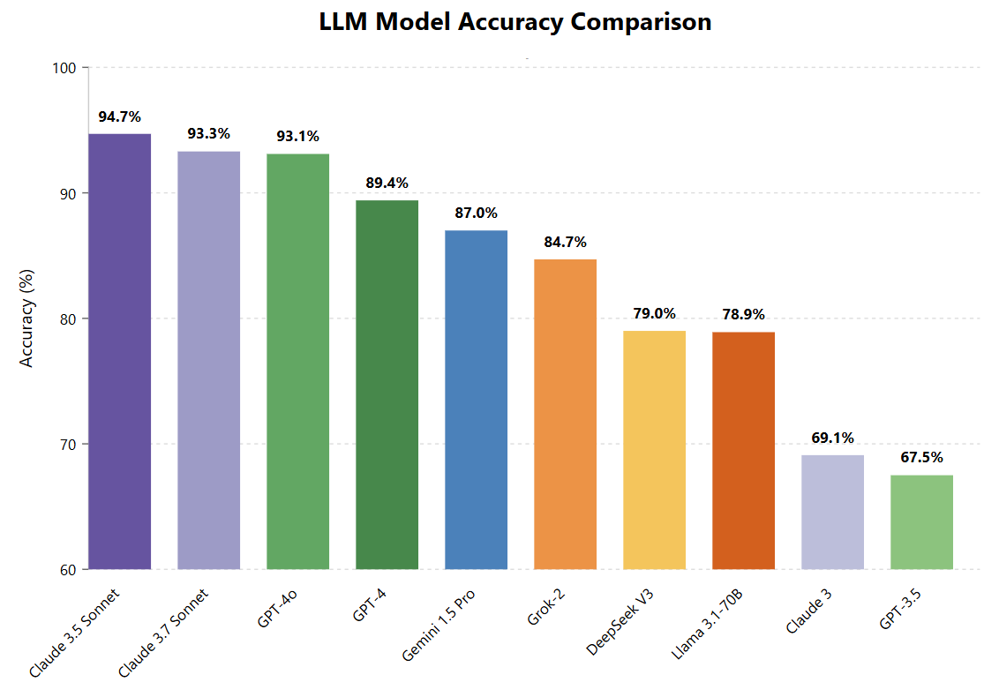

# Danish Idioms Benchmark: LLM Accuracy Comparison

**tl;dr:** This project evaluates 10 different LLMs on their ability to *"understand"* Danish idioms using DSL's *talemaader*-dataset of 1000 Danish expressions. Claude 3.5 Sonnet leads the benchmark with 94.7% accuracy, followed closely by Claude 3.7 Sonnet (93.3%) and GPT-4o (93.1%). There's a significant performance gap between these leaders and models like Claude 3 (69.1%) and GPT-3.5 (67.5%), but they are pre-historic models in LLM years - they are from March 2024 and November 2022, respectively! This benchmark provides valuable insights into how different LLMs handle Danish language comprehension, particularly with idiomatic expressions.

### Evaluating LLMs on Danish Expressions with DSL's *talemaader*-dataset
Digitaliseringsstyrelsen and Det Danske Sprog- og Litteraturselskab (DSL) have developed the 'talemaader' dataset, which consists of 1000 Danish idioms and fixed expressions. Each expression comes with one true definition and three false definitions. This project evaluates how well various Large Language Models can identify the correct definition, testing their Danish language competence.

The results show significant differences in performance across models:
- **Top performers (>90%)**: Claude 3.5 Sonnet (94.7%), Claude 3.7 Sonnet (93.3%), GPT-4o (93.1%)
- **Strong performers (85-90%)**: GPT-4 (89.4%), Gemini 1.5 Pro (87.0%)
- **Mid-range performers (75-85%)**: Grok-2 (84.7%), DeepSeek (79.0%), Llama 3.1 (78.9%)
- **Lower performers (<70%)**: Claude 3 (69.1%), GPT-3.5 (67.5%)

For a walkthrough of this project and its findings, please see the notebooks folder.

#### Dataset and license
The dataset is made available under a CC-BY license and can be downloaded via sprogteknologi.dk by [clicking here](https://sprogteknologi.dk/dataset/1000-talemader-evalueringsdatasaet). All credit goes to Det Danske Sprog- og Litteraturselskab (DSL) and Digitaliseringsstyrelsen.

This is my first project of this sort, so input, comments and suggestions are very welcome! 

#### Requested models to evaluate
The following models have been requested to be evaluated by users through social media: Grok3, ChatGPT-4.5, Gemini Flash 2, Gemma 3 27B, DanskGPT, Gemini 2.5 Pro Exp. 

<details>
<summary>🔧 Guide: Running the Danish Idioms Evaluation Pipeline with New Models</summary>
<br />
This guide provides step-by-step instructions for evaluating a new LLM on the Danish idioms dataset, specifically focused on adding Claude 3.5 Sonnet to the evaluation.

## Prerequisites

- Python environment with required packages (see requirements.txt)
- API keys set as environment variables:
  - `ANTHROPIC_API_KEY` for Claude models
  - `OPENAI_API_KEY` for GPT models
  - `GOOGLE_API_KEY` for Gemini models
  - `LLAMA_API_KEY` for Llama models
  - `XAI_API_KEY` for XAI models, i.e. GROK
  - `DEEPSEEK_API_KEY` for DeepSeek

## Step 1: Update Model Configurations

1. Open `src/config/model_configs.py` and add your new model configuration:

```python
MODEL_CONFIGS = {
    # ... existing models ...
    "claude-3-5-sonnet": {
        "model_name": "claude-3-5-sonnet-20241022",
        "max_tokens": 1,
        "temperature": 0
    }
}
```

## Step 2: Update Script Arguments

You need to update the allowed model choices in several scripts:

1. In `src/utils/run_model_predictions.py`, find the argparse section and add the new model:

```python
parser.add_argument('--model', type=str, default="gpt-4", 
                  choices=['gpt-4', 'gpt-4o', 'gemini', 'llama', 'claude', 'claude-3-5-sonnet'],
                  help='Model name to use for predictions')
```

2. Also in `src/utils/run_model_predictions.py`, update the model initialization:

```python
if model_name == 'gemini':
    self.model = GeminiModel()
elif model_name == 'llama':
    self.model = LlamaModel()
elif model_name in ['claude', 'claude-3-5-sonnet']:
    self.model = ClaudeModel(model_name="claude-3-5-sonnet-20241022" if model_name == 'claude-3-5-sonnet' else "claude-3-sonnet-20240229")
else:
    self.model = GPTModel(model_name=model_name)
```

3. In `src/utils/add_true_label.py`, update the model choices:

```python
parser.add_argument('--model', type=str, default="gpt-4", 
                  choices=['gpt-4', 'gpt-4o', 'gpt-4o-smaller-prompt', 'gemini', 'llama', 'claude', 
                           'gpt-3.5-one_shot', 'claude-3-5-sonnet'],
                  help='Model name to process (default: gpt-4)')
```

4. In `src/utils/process_discrepancies.py`, update the model choices the same way:

```python
parser.add_argument('--model', type=str, default="gpt-4", 
                  choices=['gpt-4', 'gpt-4o', 'gpt-4o-smaller-prompt', 'gemini', 'llama', 'claude', 
                           'gpt-3.5-one_shot', 'claude-3-5-sonnet'],
                  help='Model name to process (default: gpt-4)')
```

## Step 3: Run the Pipeline

Execute these commands in sequence:

1. Generate predictions (repeat until all 1000 expressions are processed):
```bash
python -m src.utils.run_model_predictions --model <model_name> --batch-size <5>
```

2. Add true labels:
```bash
python -m src.utils.add_true_label --model <model_name>
```

3. Process discrepancies:
```bash
python -m src.utils.process_discrepancies --model <model_name>
```

4. Analyze misinterpretation types and generate overview:
```bash
python results/predictions/misinterpretation_analysis.py
```

5. Calculate accuracy metrics:
```bash
python results/metrics/calculate_accuracy.py
```

## Step 4: (Optional) Check Expression Order

If you want to ensure your predictions are in the same order as the original dataset:

```python
# Create compare_order.py with the script provided
python compare_order.py
```

## Output Files

The pipeline produces these output files:

1. Predictions: `data/predictions/predicted_labels_claude-3-5-sonnet.csv`
2. Gold standard comparisons: `data/predictions/predicted_and_gold_labels_claude-3-5-sonnet.csv`
3. Discrepancies analysis: `data/processed/only_discrepancies_claude-3-5-sonnet.csv`
4. Misinterpretation analysis: `results/predictions/misinterpretations_claude-3-5-sonnet.csv`
5. Final accuracy metrics: `results/metrics/model_accuracy.csv`

## Logs

Find detailed logs in:
- `logs/batch_claude-3-5-sonnet_*.log` (predictions)
- `logs/analysis_claude-3-5-sonnet_*.log` (true label analysis)
- `logs/discrepancies_claude-3-5-sonnet_*.log` (discrepancy processing)
</details>